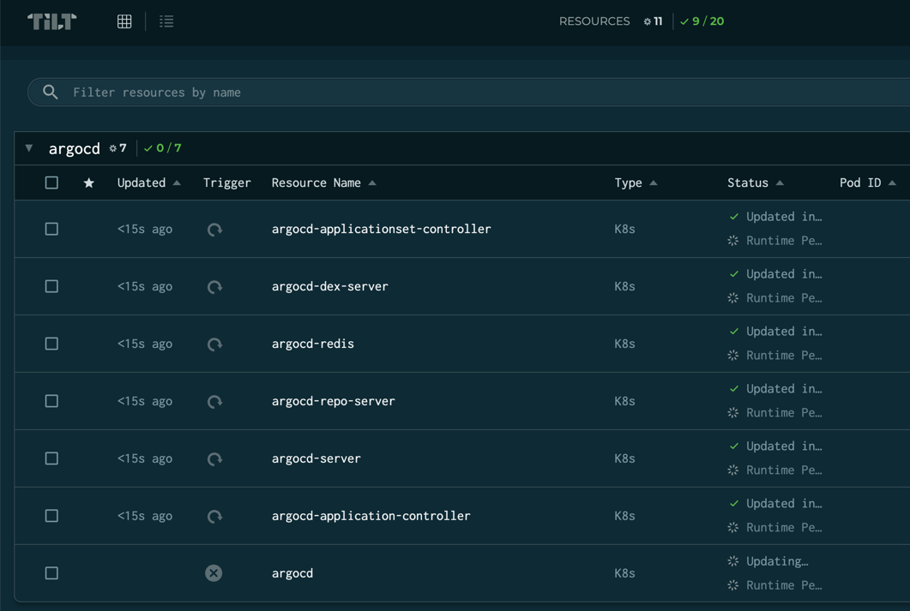
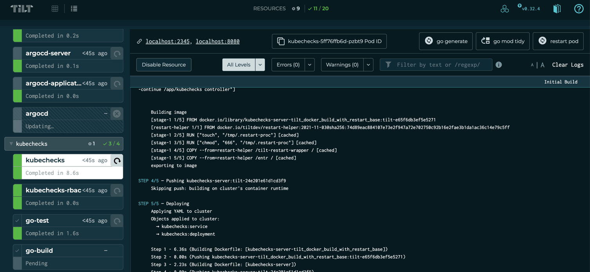

# cncflagos-demo

Demo used during CNCFLagos to Demo Argocd and Kubechecks

## Requirements
### Tools / Accounts
* [Ngrok](https://ngrok.com/)
* [Tilt](https://tilt.dev/)
* [Gitlab](https://gitlab.com) / [Github](https://github.com) token
* [OpenAI](https://openai.com) token (Optional)
* [Kubernetes](https://kubernetes.io/)
  * [minikube](https://minikube.sigs.k8s.io/docs/)
  * [kind](https://kind.sigs.k8s.io/)
  * [Docker Desktop](https://docs.docker.com/desktop/kubernetes/)


1. Clone Repo

2. Start a local kubernetes cluster either using minikube, kind or Docker Desktop. 

### Tilt

[Tilt.dev](https://tilt.dev) is used to power the local development environment.
The `Tiltfile` defines all the resources required to build, run and test `kubechecks`.
It creates:

* Gitlab / Github repository with test files.
* Deploys ArgoCD and some demo applications to your kubernetes cluster.
* Deploys ngrok to provide an external accessible URL for Github/Gitlab to send webhooks to your local dev environment.
* Deploys `kubechecks` server in the local Kubernetes cluster.

To get started do the following:

* Copy the `.env.example` and set required values.

    ```console
    cp .env.example .env
    ```

* From the root directory of this repo:

    ```console
    tilt up -- --vcs-type gitlab
    ```

You should see output like:

    ```
    Tilt started on http://localhost:10350/
    v0.30.13, built 2022-12-05

    (space) to open the browser
    (s) to stream logs (--stream=true)
    (t) to open legacy terminal mode (--legacy=true)
    (ctrl-c) to exit

    ```

In the background Tilt has started building and deploying resources.

You should go ahead and press the space bar to open the Tilt web UI.

There are currently some circular dependencies in the local dev resources, so all resources may not come up cleanly on the first launch.



Click the Detailed view button at the top, and click the refresh button next to the `Tiltfile` resource to run another cycle.




## Usage
- Access the Argocd UI by visiting: https://localhost:8081/argocd/
- Create an MR on the created gitlab repo and watch kubechecks in Action
